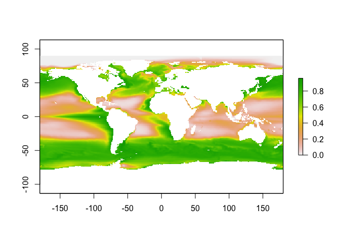
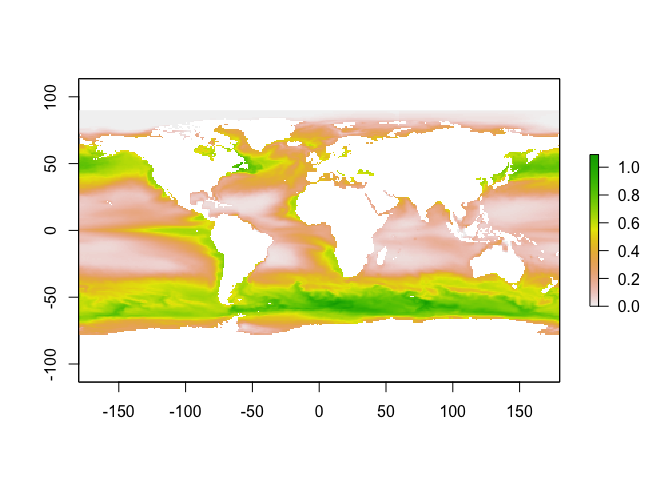
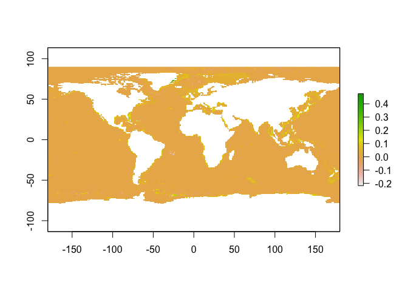
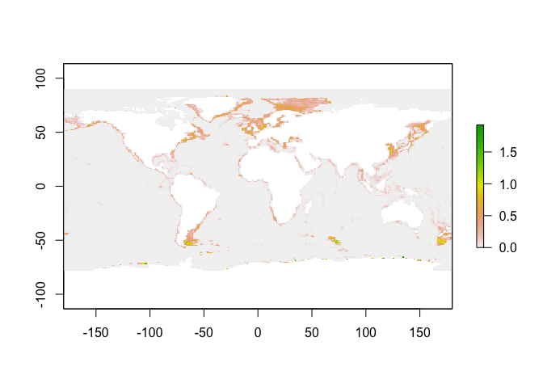

Ecosystem disturbance: Mapping biomass removal using FishMIP models
================
Julia Blanchard
5/06/2023

In Ray Hilborn’s critique of our article on the environmental footprint
of food, he focusses on our definition of disturbance pressure which we
described as:

“Marine fisheries can cause disturbance by destroying seafloor habitat
when certain gear types are used (for example, bottom trawls) and
through biomass removal throughout the water column and from the
seafloor. We estimated the degree of seafloor destruction based on
fishing effort (hours) using demersal destructive gear types. For
biomass removal, we would ideally measure the total proportion of fish
biomass removed, but because these data do not exist, we standardized
total catch by dividing the tonnes of catch by NPP to produce an impact
metric relative to natural production. The raster maps describing both
forms of marine fisheries disturbance (that is, seafloor destruction and
biomass removal) are rescaled to values between 0 to 1 by determining,
for each map, the value across all the raster cells corresponding to the
99.9th quantile and dividing all the raster cells by this value. The two
rescaled rasters were then averaged to get total marine fisheries
disturbance. To make this measure comparable to land disturbance
(measured in km2), we multiplied this rescaled score by the
two-dimensional area of the ocean cell. Our decision to rescale
fisheries disturbance by the 99.9th quantile assumes 0.1% of ocean area
is highly disturbed by fishing (for example, has a fully disturbed value
of 1). However, this value is highly uncertain, and we explored the
sensitivity of our results to alternative assumptions (Supplementary
Methods and Supplementary Table 12).”

While Hilborn considers the assumptions we used for crops to be a
reasonable approximation (where area occupied is assumed to remove all
native plants and animals) he argues that for fishing there will be
minimal disturbance. He uses outputs of ecosystem models to show that
the “proportion of native biomass removed over total biomass” should be
close to zero for fished ecosystems.

We acknowledged in our paper that there are large uncertainties
surrounding global fishing pressure. We also acknowledged that the
disturbance from fishing should be less than that of agriculture
land-use change.

In the absence of global biomass data, and as an attempt to capture the
degree to which fishing activity creates a disturbance, we considered
catch_food/NPP where NPP was a proxy for system production in each
gridcell.

While we do not have total native biomass globally, or even total system
production, we do have global models that attempt to convert primary
production to biomass of marine animals (as there is no single consensus
on how this works for marine ecosystems therefore we have an ensemble).
These models are not (yet) directly usuable for the footprint assessment
of spatially explicit disturbance because the published outputs have not
used standardised historical fishing pressures.

However, they might provide some potentially useful insights that we
could use as a testbed for Ray’s point about ecosystem disturbance.

## FishMIP models

FishMIP has produced an ensemble of global marine ecosystem models. We
are currently working on standardised historical fishing runs, but our
recent published results ([Tittensor et
al. 2021](https://www.nature.com/articles/s41558-021-01173-9))

Note: For climate projections, we typically use at least 2 Earth System
Models to analyse these models, here we use 1 - the GFDL model as we are
just looking at the effect of fishing.

But be aware there are large uncertainties across these models (as will
be revealed below).

``` r
#install.packages("ncdf4")
#install.packages("terra")
#install.packages("raster")
#install.packages("sf")
#install.packages("rgdal")
library(ncdf4)
library(raster)
library(sf)
library(dplyr)
library(ggplot2)
library(terra)
library(rgdal)
```

We have fished and unfished biomass for two models in FishMIP that have
been published (Note: models with more realistic and standardised
fishing are currently being run and are unpublished).

We will calculate the removal index as 1 -
biomass_fished/biomass_unfished, where biomass is all consumers in the
system. This is comparable to what Ray has presented in his critique but
the biomass we rpesent in the first instance is aggregated across all
trophic levels.

## BOATS - Biomass removal

First let’s start with BOATS, a size-structured model of marine
ecosystems.

``` r
# read in year index for the netcdf file
Years<- read.csv("years.csv")[,2]
filename<-"boats_gfdl-esm4_nobasd_historical_histsoc_default_tcb_global_monthly_1950_2014.nc"
filename2<-"boats_gfdl-esm4_nobasd_historical_nat_default_tcb_global_monthly_1950_2014.nc"

tcb_fished <- brick(file.path(filename))
tcb_unfished <- brick(file.path(filename2))

#subset  years from 2000 onwards

# min(which(Years==2000))
# max(which(Years==2014))

tcb_fished<-subset(tcb_fished,601:780)
tcb_unfished<-subset(tcb_unfished,601:780)


#get mean

mean_tcb_fished<-mean(tcb_fished)

mean_tcb_unfished<-mean(tcb_unfished)

biomass_ratio<-mean_tcb_fished/mean_tcb_unfished

removal_index<-(1-biomass_ratio)

plot(removal_index)
```

<!-- -->

BOATS shows that there are actually quiet a lot of grid cells where the
proportional reduction in biomass is not 1 but is fairly high - 0.8.

## BOATS- Catch/NPP

How does the catch/npp approach compare to the above?

Here we will use model inputs form GFDL (integrated NPP across the water
column) and modeled catches.

``` r
filename3<-"gfdl-esm4_r1i1p1f1_historical_intpp_60arcmin_global_monthly_1850_2014.nc"

intpp <- brick(file.path(filename3))

intpp<-subset(intpp,1801:1980)

intpp<-mean(intpp)        


filename4<-"boats_gfdl-esm4_nobasd_historical_histsoc_default_tc_global_monthly_1950_2014.nc"

tc <- brick(file.path(filename4))

tc<-subset(tc,601:780)

tc<-mean(tc)        

c_npp<-tc/intpp

val<-quantile(c_npp, probs = c(0.999), type=7,names = FALSE)

d<-c_npp/val

plot(d)
```

<!-- -->

## ECOOCEAN

Now let’s look at ECOOCEAN, this model has different functional groups
considered in the ecosystem, not size structured - and I think Hilborn
might have used this model in his example Christensen et al. but
spatially aggregated? Need to check.

``` r
# read in year index for the netcdf file
Years<- read.csv("years.csv")[,2]
filename<-"ecoocean_gfdl-esm4_nobasd_historical_histsoc_default_tcb_global_monthly_1950_2014.nc"
filename2<-"ecoocean_gfdl-esm4_nobasd_historical_nat_default_tcb_global_monthly_1950_2014.nc"

tcb_fished <- brick(file.path(filename))
tcb_unfished <- brick(file.path(filename2))

#subset  years from 2000 onwards

# min(which(Years==2000))
# max(which(Years==2014))

tcb_fished<-subset(tcb_fished,601:780)
tcb_unfished<-subset(tcb_unfished,601:780)


#get mean

mean_tcb_fished<-mean(tcb_fished)

mean_tcb_unfished<-mean(tcb_unfished)

biomass_ratio<-mean_tcb_fished/mean_tcb_unfished

removal_index<-(1-biomass_ratio)

plot(removal_index)
```

<!-- -->

``` r
# plot(mean_tcb_fished)
# plot(mean_tcb_unfished)
```

ECOOCEAN on the other hand, which includes non-fish groups such as
marine mammals, shows very little change in total consumer biomass. In
some cases more biomass with fishing.

## ECOOCEAN - Catch and NPP

``` r
filename5<-"ecoocean_gfdl-esm4_nobasd_historical_histsoc_default_tc_global_monthly_1950_2014.nc"

tc <- brick(file.path(filename5))

tc<-subset(tc,601:780)

tc<-mean(tc)

#replace missing values with 0
tc[tc >= 1e20]<-0


c_npp<-tc/intpp

val<-quantile(c_npp, probs = c(0.999), type=7,names = FALSE)

d<-c_npp/val


plot(d)
```

<!-- -->

## Conclusion

Across these two models, which both produce outputs for total consumer
biomass (based on different functional groups, and different fishing
forcing) in the ocean the largest fraction of removal can be very
different. I think Ray is drawing conclusions from a model that is
relative insensitive to the effects of fishing.

However, within each model, comparing the biomass removal to our
approach of catch/NPP yields that ours would be general give lower
disturbance for BOATS. And higher disturbance for ECOOCEAN, particularly
inn coastal cells that dominate the catches, with pattern that mirrors
the catch rather than biomass removal.

## Next steps

What would be the best way to calculate ecosystem disturbance - should
it be only for the fish or the wider ecosystem ?

While we would not use these models directly for the metrics we could
demonstrate the use the BOATS model inputs for netpp and outputs for
catch (and scale to max grid cell) to compare our original published
metric for the disturbance with this one, assuming they are both derived
from the same underlying “true” ecosystem.

This could be a way to simulation test our and other methods for
calculating disturbance?
